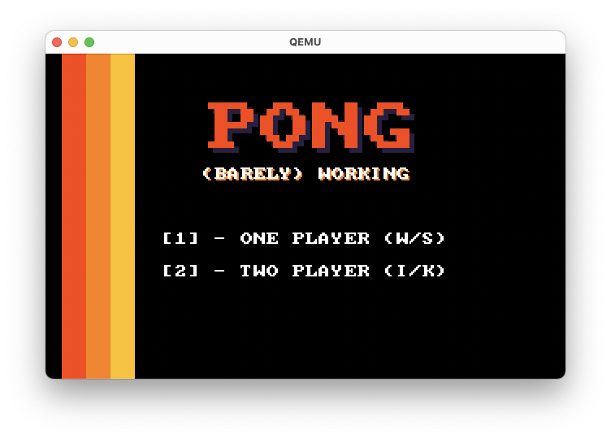
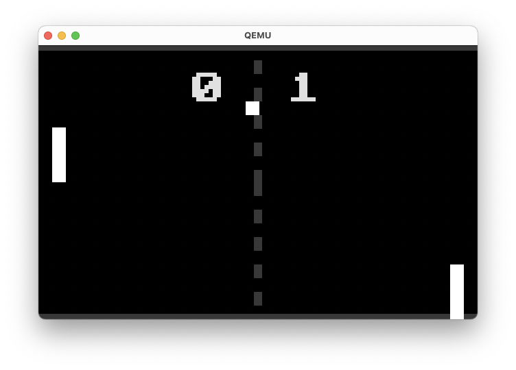

# Pong-OS: An OS Just to Play Pong

A custom ring 0 bare metal OS.



## About

This project was brought into life because I always wanted to be able to say that I had made an operating system. And this would be the perfect oppertunity. The OS will only run my custom implementation of pong the game. Hence that it is called "Pong OS". Pong OS runs on i386 architecture and provides a lightweight microkernel with only the necessary functionalities to support the game.



## Design Goals

The primary design goal of Pong OS is to create a lightweight and efficient operating system with a minimal microkernel. The OS includes only the essential features required to run Pong the game.

## Features

- Custom implementation of Pong
- Minimal microkernel
- Basic keyboard and timer interrupt handling
- VGA graphics support for rendering the game
- Serial port communication for debugging

## Requirements

- QEMU emulator
- GCC (i686-elf-gcc)
- NASM (Netwide Assembler)

## Building Instructions

1. Clone the repository:

```sh
git clone https://github.com/DennisCMoes/Pong-OS
cd Pong-OS
```

2. Build the OS and run:

```sh
make
```

## Makefile Targets

- `make` - Cleans the build, compiles the OS, creates the bootable ISO image, and runs this ISO in QEMU
- `make clean` - Cleans the build artifacts.
- `make bootloader` - Compiles the bootloader.
- `make kernel` - Compiles the kernel.
- `make iso` - Uses the bootloader and kernel to create a bootable ISO image.
- `make qemu` - Runs the OS in the QEMU emulator.

## Game Controls

- `W/S` - Move left paddle up/down
- `I/K` - Move right paddle up/down (in two-player mode)
- `1` - Start single-player game
- `2` - Start two-player game
- `ESC` - Return to the main menu